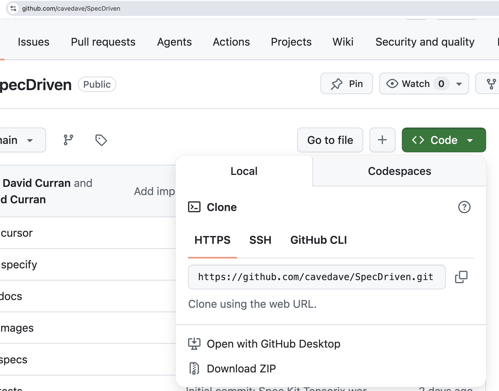

# SpecDriven — Tensorx workshop

Spec-driven development workshop using the [TensorX API](https://docs.tensorx.ai/). Target vision model: `qwen/qwen3-vl-235b-a22b-instruct`.

Development uses [Spec Kit](https://github.com/github/spec-kit): constitution → specify → plan → tasks → implement → test/review → refine spec → repeat.

Good book on spec driven development: [Spec-Driven Development (Leanpub)](https://leanpub.com/spec-driven-development-build-with-ai)

## What’s in this repo (starter)

| Pre-built (don’t SDD these) | You build live in the workshop |
|-----------------------------|--------------------------------|
| Spec Kit + [constitution](.specify/memory/constitution.md) | **Slice 1** — receipt upload + file size |
| Product vision [`specs/000-receipt-reader/vision.md`](specs/000-receipt-reader/vision.md) | **Slice 2** — OCR (**Extract text**) |
| Smoke test: `hello_tensorx.py`, `tensorx_client.py` | **Slice 3** *(optional)* — purchase analysis |
| Workshop test receipt in `images/` | `app.py`, specs under `specs/001-*`, `specs/002-*`, tests |

Clone this repo at the **start** of the workshop. Each slice adds code and a new folder under `specs/` via `/speckit.specify` → plan → tasks → implement.

## Workshop slides

In [docs/](docs/) — PDF and macOS Keynote versions:

- **PDF:** [docs/Tensorx.pdf](docs/Tensorx.pdf)
- **Keynote:** `docs/Tensorx.key` (macOS, editable source)

## Setup (virtual environment)

Download or clone from [github.com/cavedave/SpecDriven](https://github.com/cavedave/SpecDriven) — **Code** → **Download ZIP**:



```bash
git clone https://github.com/cavedave/SpecDriven.git
cd SpecDriven
python3 -m venv .venv
source .venv/bin/activate
pip install -r requirements.txt
```

To leave the venv: `deactivate`

## Secrets

```bash
cp .env.example .env
# Edit .env: set TENSORX_API_KEY
```

Get a key from [app.tensorx.ai](https://app.tensorx.ai). Never commit `.env`.

## Smoke test (before slice 1)

Prove Tensorx connectivity — pre-built, not an SDD slice:

```bash
source .venv/bin/activate
python hello_tensorx.py
```

Expected: stdout includes **Paris**.

## Workshop flow

1. **Smoke test** — run `hello_tensorx.py` (see below). Pre-built; not an SDD slice.
2. **Slice 1** — `/speckit.specify` for receipt ingest (upload jpg/png, show name + size). No API key needed.
3. **Slice 2** — `/speckit.specify` for OCR (**Extract text** button, Tensorx vision, spinner, errors).
4. **Slice 3** *(if time)* — analyze purchases (good/warning items).

Test receipt for all slices: `images/2026.06.09_170002748320260609132561.jpg.png` (Lidl, ~1.3 MB).

Run the app (after slice 1): `python -m streamlit run app.py` — use `python -m streamlit`, not bare `streamlit`, so the venv Python is used.

## Test

```bash
source .venv/bin/activate
pytest -v
```

(Smoke-test client tests only at starter; slice tasks add more.)
